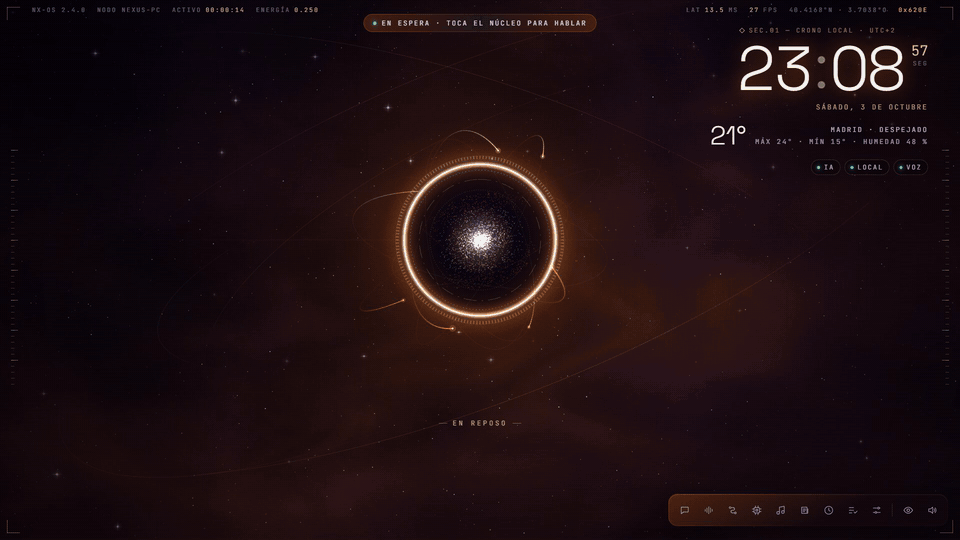
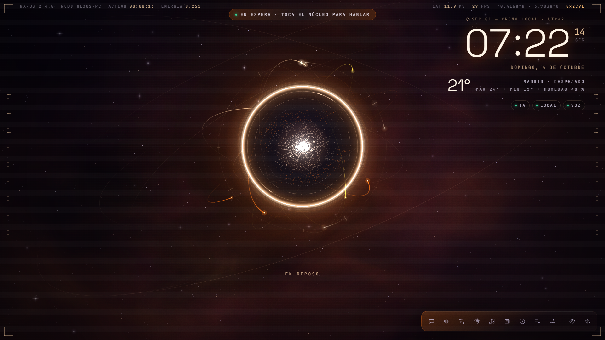
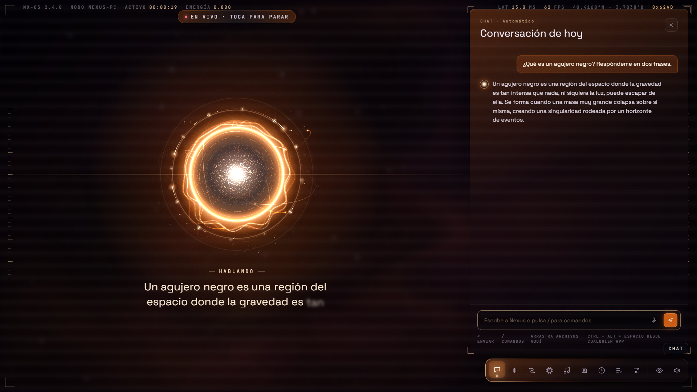
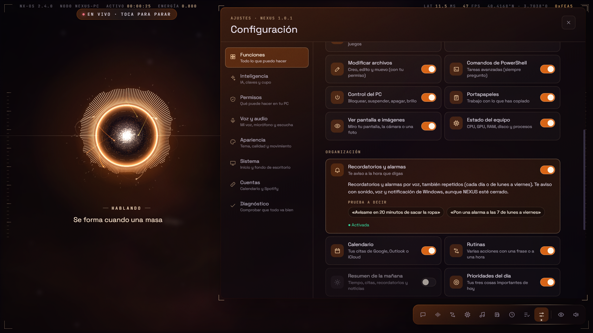
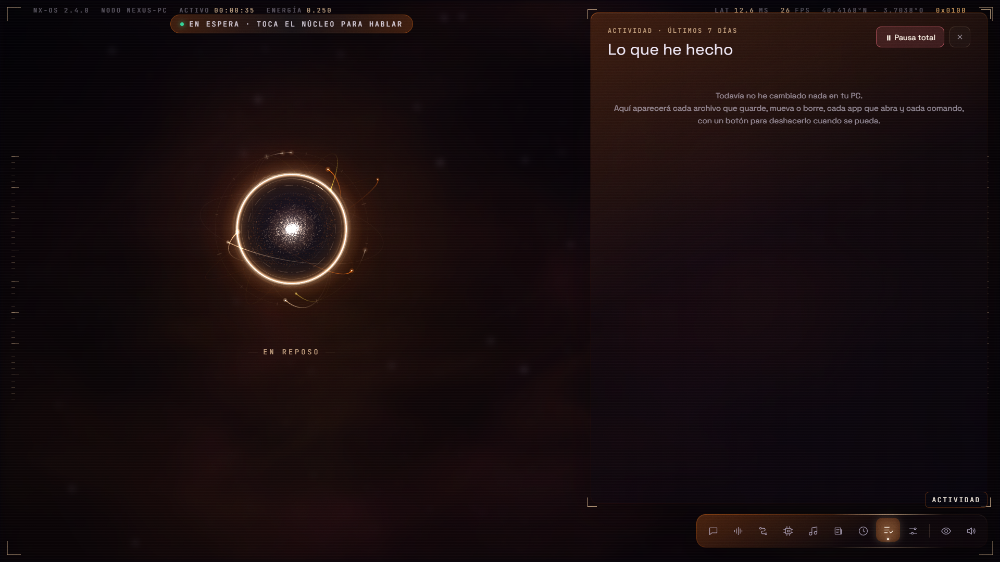
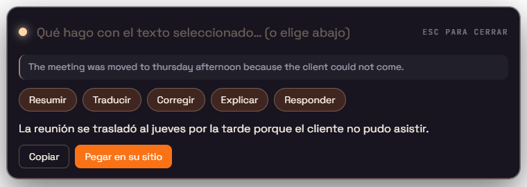
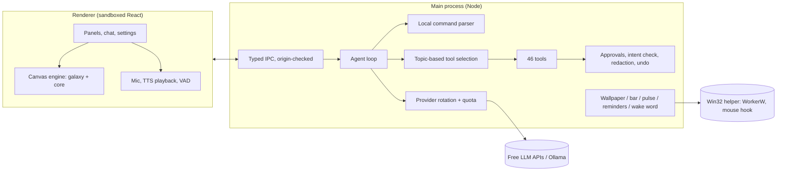

# NEXUS

**A J.A.R.V.I.S.-style desktop assistant for Windows.** An animated energy core living in a galaxy that listens,
talks back and gets things done on your PC — and can sit behind your desktop icons as a live wallpaper.

[](https://github.com/AleixAj/nexus/actions/workflows/ci.yml)




<h2 align="center">DOWNLOAD</h2>

<p align="center">
  <a href="https://github.com/AleixAj/nexus/releases/latest/download/NEXUS-Setup.exe">
    
  </a>
</p>
<p align="center">
  <a href="https://github.com/AleixAj/nexus/releases/latest/download/NEXUS-Portable.zip">
    
  </a>
</p>
<p align="center">
  <sub>Windows 10 and 11 · Interface in Spanish · <a href="https://github.com/AleixAj/nexus/releases">All versions</a></sub>
</p>

> The interface is in Spanish (it was built for Spanish speakers). Full user documentation in Spanish:
> [README.es.md](README.es.md).

## What it does

- **Voice and chat** with an LLM agent that uses **46 tools**: web search and deep research with cited sources, files
  (read, write, move — with undo), apps, Spotify, Steam, reminders and alarms, calendar, PC control, clipboard,
  screen and camera vision, PowerPoint generation and more.
- **Custom wake phrase, fully offline** ("Oye Jarvis", "Hey Nexus"…): streaming speech recognition on-device with
  sherpa-onnx and fuzzy phonetic matching. Nothing is recorded or sent.
- **Live wallpaper mode**: the window is re-parented behind the desktop icons (the WorkerW technique), stays clickable
  through a low-level mouse hook, can extend to every monitor and pauses itself when a fullscreen game covers it.
- **Floating bar** (`Ctrl+Alt+A`) to ask from any app, and **actions on selected text** (`Ctrl+Alt+S`): summarise,
  translate, fix, explain or reply, then paste the result back in place.
- **Proactive but bounded**: meeting in 10 minutes, PC maxed out, low battery, morning and evening summaries — capped
  per day, silent at night, and never out loud while you game or present.
- **Every feature can be switched off** from one screen; a switched-off feature really disappears (tools, hotkeys, UI).

<table>
  <tr>
    <td></td>
    <td></td>
  </tr>
  <tr>
    <td></td>
    <td></td>
  </tr>
</table>
<p align="center"></p>

## Engineering highlights

**Agent loop that runs on free tiers.** Several LLM providers rotate automatically (Groq, Gemini, OpenRouter, Mistral, Cerebras
and local Ollama) with per-model rate-limit tracking and a daily quota meter. Requests are kept small on
purpose: simple commands ("pause", "open Discord", "remind me in 20 minutes") are parsed locally and never hit the
LLM; each question only receives the tools of its topic (~1,900 tokens per request instead of ~5,000); read-only
tools run in parallel; long inputs are trimmed from history.

**Security treated as a feature.** The agent works with untrusted input (web pages, files, the screen), so:
serious actions require the user's own words, not just the model's decision; facts learnt next to outside content stay
"pending" until approved; secrets are redacted before reaching the LLM; credential files and browser profiles cannot be
read; the agent can never write to Windows startup, PowerShell profiles or its own permission files; files that run
code always need explicit approval; web reads are restricted to the public internet (no localhost/LAN, also after
redirects). On the Electron side: sandboxed renderers with context isolation, a strict CSP, IPC accepted only from the
app's own page, no pop-ups or navigation, media permissions only for the main window, and Electron fuses (no
`RunAsNode`, no `--inspect`, asar integrity). Keys are encrypted with Windows DPAPI. Details in
[README.es.md → Seguridad](README.es.md#seguridad).

**Deep Windows integration without native modules.** Win32 calls (WorkerW wallpaper, mouse hook, fullscreen and
"do not disturb" detection) go through a small C# helper compiled once by PowerShell and cached as a DLL. Media
sessions (GSMTC) for Spotify, Task Scheduler for reminders that fire even when the app is closed, Steam library parsing.

**Built to stay on all day.** Four power levels in the render engine (full / 30 fps / 15 fps / paused), canvases shrink
when hidden, audio contexts suspend in silence. Measured on the installed app: ~0.1–0.5 % of one core in the tray or
as a covered wallpaper.

**Reliability.** Undo checkpoints for every file change, an activity log, an emergency pause, a built-in self-test of
every service, and clipboard contents (images included) preserved whenever the app borrows the clipboard.

## Architecture



## Tech stack

Electron 44 · React 19 · TypeScript · electron-vite · Vitest · sherpa-onnx (offline ASR) · Microsoft Edge TTS ·
OpenAI-compatible LLM APIs · PowerShell + C# for Win32 · PptxGenJS · GitHub Actions.

## Running it

Requirements: Windows 10/11 and Node.js 20+. At least one free AI key (Groq is recommended; the app explains how to
get one on first start).

```bash
npm install
npm run dev          # development, with hot reload
npm test             # unit tests (Vitest)
npm run typecheck
npm run dist         # packaged app in dist/
```

Ready-to-use builds are in [Releases](https://github.com/AleixAj/nexus/releases): an installer that keeps itself up
to date (electron-updater, from GitHub Releases) and a portable zip. They are not code-signed, so Windows SmartScreen
warns on first run (*More info → Run anyway*). To publish a new version: `npm run release` (builds and uploads a
draft with the GitHub CLI).

## Project structure

```
src/main/        Electron main process: agent (brain/), tools/, wallpaper, bar, reminders, security
src/preload/     The only bridge between the page and the main process
src/renderer/    React UI (app/ = state and features, views/ = components, engine/ = canvas renderer)
test/            Unit tests: local command parsing, security rules, routing, wake phrase matching
```

## How it was built

NEXUS was built by me with **[Claude Code](https://claude.com/claude-code) as an AI pair programmer** — the commit
history shows it (`Co-Authored-By: Claude`). My part was product and engineering direction: deciding what the app
should do and how it should behave, setting the constraints (free services only, always-on, privacy first), reviewing
and testing every feature on a real machine, pushing for the security and performance work, and making the
trade-offs. Working this way is a deliberate part of the project: it shows how far one person can take a product
with AI tooling while keeping control of quality.

## License

MIT — see [LICENSE](LICENSE). Third-party code, services, fonts and the ideas adapted from other open-source assistants
are credited in [THIRD_PARTY_NOTICES.md](THIRD_PARTY_NOTICES.md).
